# {{NAME}}

**{{TAGLINE}}**

[LinkedIn]({{LINKEDIN_URL}}) &nbsp;&middot;&nbsp; [Instagram]({{INSTAGRAM_URL}})

<table align="center">
  <tr>
    <td valign="middle">
      <picture>
        <source media="(prefers-color-scheme: dark)" srcset="avi-ascii-dark.svg">
        
      </picture>
    </td>
    <td valign="middle">
      <picture>
        <source media="(prefers-color-scheme: dark)" srcset="info-card-dark.svg">
        
      </picture>
    </td>
  </tr>
</table>

<picture>
  <source media="(prefers-color-scheme: dark)" srcset="contrib-heatmap-dark.svg">
  
</picture>

