# {{NAME}}

**{{TAGLINE}}**

[LinkedIn]({{LINKEDIN_URL}}) &nbsp;&middot;&nbsp; [Instagram]({{INSTAGRAM_URL}})

<table align="center">
  <tr>
    <td valign="middle"></td>
    <td valign="middle"></td>
  </tr>
</table>

